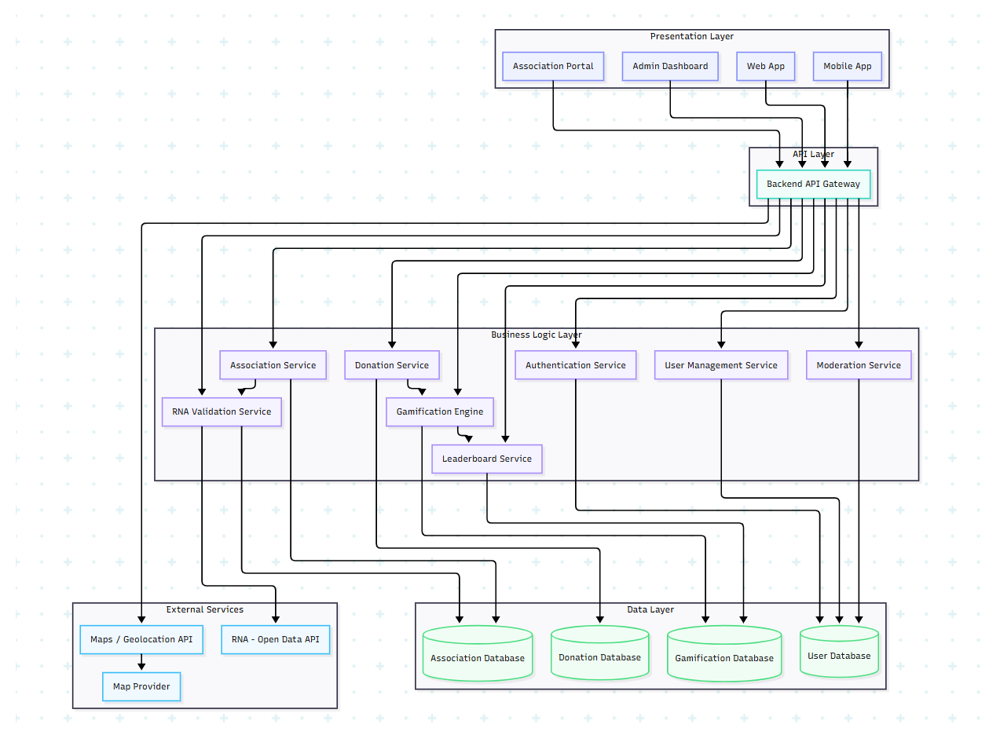

***
# Table of Contents
1. [Brainstorming and MVP](#1-brainstorming-and-mvp)
    - [Project Overview](#project-overview)
    - [Evaluation Criteria](#evaluation-criteria)
    - [Overall Conclusion](#overall-conclusion)
    - [Reflection and Ideation Process](#reflection-and-ideation-process)
    - [Final Idea](#final-idea)
    - [MVP Definition](#mvp-definition)
    - [SMART Objectives](#smart-objectives)
    - [Project Scope](#project-scope)
    - [Risks and Solutions](#risks-and-solutions)
    - [Final Conclusion](#final-conclusion)
2. [Project Planning](#2-project-planning)
    - [General and Specific Objectives of the Project](#general-and-specific-objectives-of-the-project)
    - [Project Scope](#project-scope)
    - [Key Elements of the Project](#key-elements-of-the-project)
    - [SMART Objectives](#smart-objectives)
    - [SMART Objectives Detailed by MVP](#smart-objectives-detailed-by-mvp)
    - [High-Level Project Timeline](#high-level-project-timeline)
    - [Conclusion](#conclusion)
3. [Technical Documentation](#3-technical-documentation)
    - [User Stories and Mockups](#user-stories-and-mockups)
    - [System Architecture](#system-architecture)
    - [Components, Classes, and Database Design](#components-classes-and-database-design)
    - [High-Level Sequence Diagrams](#high-level-sequence-diagrams)
    - [External and Internal APIs Documentation](#external-and-internal-apis-documentation)
    - [Plan SCM and QA Strategies](#plan-scm-and-qa-strategies)

***
# 1. Brainstorming and MVP
## Project Overview
This project is a gamified application designed to encourage donations to charitable organizations. It aims to increase user engagement through game mechanics and motivate people to contribute more easily and frequently.
## Evaluation Criteria
| Criterion | Analysis | Conclusion |
|----------|----------|----------|
| Impact  | Positive – Responds to a real need by encouraging more donations.  | High social value  |
| Feasibility  | Medium – Possible with current skills, but the application will not be fully completed or optimized.  | Partially achievable  |
|Technical Alignment | Medium – Some technologies are mastered, others require learning. | Requires adaptation |
| Scalability | High – Strong potential for future feature expansion. | Very promising |
| Risk | High – Due to time constraints and technical complexity. | Requires strict scope control |
## Overall Conclusion
The project is feasible despite technical complexity and limited time. A functional MVP can be achieved if priorities are well defined.
## Reflection and Ideation Process
Although I started with a strong personal idea, I followed a structured research process to ensure its relevance and realism.
### I analyzed:
- Real-world problems
- Existing solutions
- Current market and technology trends

This helped me better understand the context of the project.

To structure my thinking, I used the “How Might We” technique, which helped reformulate the problem into opportunities such as:
- Improving donation accessibility
- Increasing motivation to donate

This reflection confirmed the value, feasibility, and relevance of the project.
## Final Idea
A gamified application that encourages charitable donations through engagement and progression systems.
## MVP Definition
### Problem
Charitable organizations lack visibility, and users often lack motivation to donate.
### Solution
A gamified system that encourages donations through rewards and engagement mechanics.
### Target Users
- Young adults
- Users interested in gamification
- Socially engaged individuals
### Platform
Web and mobile application
### Reason for Choosing This Idea
- Strong personal motivation
- Social impact
- Feasible implementation
## SMART Objectives
### User Registration System
- Simple account creation for users and organizations.
### Interactive Map
- Display nearby organizations and donation locations via geolocation.
### Leveling System (Core Feature)
- Users gain experience points through actions; this is the main mechanic of the application.
## Project Scope
### In Scope (MVP)
- Simple interface
- Point system
- Home page
- User profile
- Basic missions and challenges
### Out of Scope
- Real financial donations
- Reward marketplace
- Global leaderboards
- Push notifications
## Risks and Solutions
### Risks
- Lack of time
- Technical complexity
- Learning new technologies
### Solutions
- Focus on MVP only
- Break tasks into smaller steps
- Prioritize core features
## Final Conclusion
This project combines social impact and gamification in a meaningful way. While ambitious, it remains achievable if the scope is controlled and the MVP is prioritized.
***
# 2. Project Planning
## General and Specific Objectives of the Project
The purpose of Donify is to make charitable organizations more easily locatable and centralized for their actions and needs, so that donors can quickly find them and interact with them effectively.
The goal of the project is to create a web platform as well as a mobile application to give visibility to often overlooked organizations. This application aims to encourage people to make donations, whether material, human, or financial, in the form of a fun and modern game.

## Project Scope
To guarantee feasibility and clarity, the project is intentionally confined to a restricted scope, consistent with an MVP approach.
### In Scope :
The project consists of creating a website and a mobile application that allow users to easily discover and locate charitable organizations in their area, as well as to know the types of donations expected. An interactive map will enable users to view the organizations and get directions to reach them.
To encourage participation, the application will reward top donors with a variety of virtual cosmetics to customize their profiles. A donor leaderboard will be implemented to distribute these premium rewards in a fun and motivating way.
### Out of Scope :
The project does not include the management of online payments or financial donations, nor the sale of products or services. No advertising, brand promotion, or commercial partnerships will be integrated into the platform.
Advanced social features, such as messaging, forums, or user interactions, are excluded. Advanced profile customization and complex reward systems are not planned beyond basic cosmetic elements.
Finally, the project does not cover large-scale scalability, the management of a large number of organizations at a national or international level, nor monetization features at this stage of development.
## Key Elements of the Project
The project is built around the goal of enabling any user who wishes to contribute to a charitable organization to quickly and easily know where to go, what types of donations are accepted, and how to reach the organization.
To add a playful dimension and encourage engagement, the project introduces a customizable user profile system, which users can decorate with various rewards earned based on the donations they make.

## SMART Objectives
SMART objectives are used to define clear and effective goals. They ensure that each objective is specific, measurable, achievable, relevant to the project, and time-bound.

### Specific :
Develop a platform that provides information about local organizations, shows how to reach them, and offers cosmetic rewards for top donors.

### Measurable :
Include at least 50 organizations, a functional interactive map, a basic user profile, and 5 types of cosmetic rewards with a leaderboard of the top 10 donors.

### Achievable :
Use accessible technologies, without online sales, advertising, or advanced social features.

### Relevant :
Facilitate civic engagement and responsible donations, while giving visibility to often overlooked organizations.

### Time-bound :
Complete MVP ready within 12 weeks.
## SMART Objectives Detailed by MVP
### Organization Directory :
Create a database listing local organizations with essential information (name, types of accepted donations, address, contact). Include at least 50 organizations before the MVP launch (6 weeks).

### Interactive Map :
Allow users to view organizations on a map and get directions. Each organization must be clickable and locatable before the MVP launch (8 weeks).

### Basic User Profile System :
Allow the creation of a simple profile to track donations and rewards. 80% of tested users must be able to create and view their profile without difficulty (10 weeks).

### Minimal Gamification :
Add a system of cosmetic rewards and a donor leaderboard. Include 5 types of rewards and a ranking of the top 10 donors (12 weeks).

### Simple and Accessible Interface :
Create an intuitive web and mobile interface with clear navigation and a quick questionnaire. Users should be able to find an organization and complete the questionnaire in under 3 minutes (12 weeks).

## High-Level Project Timeline
| Stage | Period | Project Phase | Description |
|----------|----------|----------|----------|
|Stage 1|April 20 - May 1, 2026|Team Formation, Brainstorming ,MVP Definition and Project Planning |Definition of the project idea, objectives, scope, and MVP. This stage aims to clarify the concept and establish the foundational elements of the project. Organizing the project plan and defining the objectives, scope, SMART goals, and overall strategy to ensure a realistic and well-structured project.
|Stage 2|May 4 - May 22, 2026|Technical Documentation| Preparation of technical and functional documentation to present the structure, logic, and key components of the project, before and during the development phase.
|Stage 3|May 25 - Jully 3, 2026|MVP Development and Execution | Development of the MVP, including the implementation of essential features, followed by testing, optimizations, and updates to the documentation throughout the project.
|Stage 4|jully 6 - jully 17, 2026|Project Closure and Final Delivery| Final checks, completion of the portfolio and landing page, and preparation for evaluation and final presentation.
## Conclusion
The Donnify project aims to create a web and mobile platform that allows users to easily discover and contribute to local charitable organizations, while incorporating a playful element to encourage donations. Users can quickly identify where to go, what types of donations are expected, and how to access the organizations through a clear and intuitive interface.
The project is built on a well-structured plan: SMART objectives, defined scope, and a targeted MVP, including the organization directory, interactive map, basic user profile, gamification, and a simple interface. Each stage—from planning to launch—ensures an efficient and organized deployment.
Donify combines innovation, accessibility, and civic engagement, offering organizations greater visibility and users a simple, fun, and responsible way to contribute, while laying the foundation for future enhancements.
# 3. Technical Documentation
## User Stories and Mockups
### Types of Users :
- Users : Searches for charitable organizations, reviews their needs, tracks their donations and rewards, and customizes their profile.
- Associations : Verifies and validates received donations, and evaluates donors when it comes to time-based donations.
- Administrators : Certifies association accounts by applying a ‘certified’ badge and ensures the moderation of users and associations.

### User Stories :
| ID | Users Stories | Priority |
|----------|----------|----------|
|User Stories 1|As a user, I want to be able to create an account.|Must Have|
|User Stories 2|As a user, I want to be able to access my profile to manage my donations and rewards.|Must Have|
|User Stories 3|As a user, I want to access the interactive map that locates me so I can find nearby associations.|Must Have|
|User Stories 4|As a user, I want to receive cosmetic rewards for my donations in order to personalize my profile.|Must Have|
|User Stories 5|As a user, I want to see the donation leaderboard so I can compare my contribution with other profiles.|Should Have|
|User Stories 6|As a user, I want to be able to personalize my profile with the premium rewards linked to the leaderboard.|Could Have|
|User Stories 7|As an association, I want to validate received donations to ensure their compliance.|Must Have|
|User Stories 8|As an association, I want to give non-customizable feedback on a donor for a time donation to reflect their participation and reliability.|Should Have|
|User Stories 9|As an administrator, I want to manually certify association accounts that do not meet the automatic certification criteria to ensure their legitimacy.|Must Have|
|User Stories 10|As an administrator, I want to moderate users and associations to prevent any misconduct or inappropriate behavior.|Must Have|
### Justification of Prioritization :
- Must Have: Essential features for the MVP (account creation, viewing organizations, interactive map, donation validation, rewards tracking, association certification, moderation).
- Should Have: Features that enhance user experience and motivation (donor leaderboard, association feedback, premium rewards linked to the leaderboard).
- Could Have: User profile customization via premium rewards.
### Mockups (User Interface) :
The MVP includes both a web and mobile interface. Mockups have been created to visualize the main screens.
#### Main Screens:
##### Login / Sign-up Page :
- Fields: email, password (optional for association accounts: RNA number, association name)
- Buttons: Log In, Sign Up
##### Organizations Directory :
- List of the 3 nearest organizations with name, types of donations, and address
- Access to the interactive map
##### Interactive Map :
- Organization locations
- Ability to click on an organization to view its details
- Directions indication
##### User Profile :
- View of earned rewards
- Ability to personalize the profile
- Non-customizable feedback left by associations after time donations
##### Donor Leaderboard :
- Top 10 donors
##### Association Page :
- Validation of received donations
- Non-customizable evaluation of donors for time donations
##### Administrator Page :
- Certification of association accounts
- Moderation of users and associations
#### User Stories – Mockups Mapping :
|Mockup / Page|User Stories|Priority|
|----------|----------|----------|
|Login / Sign-up Page|Users stories 1|Must Have|
|Organizations Directory|Users stories 3|Must Have|
|Interactive Map|Users stories 3|Must Have|
|User Profile|Users stories 2 / 4 / 6|Must Have / Could Have|
|Donor Leaderboard|Users stories 5|Should Have|
|Association Page|Users stories 7 / 8|Must Have / Should Have|
|Administrator Page|Users stories 9 / 10|Must Have|
## System Architecture

## Components, Classes, and Database Design
## High-Level Sequence Diagrams
## External and Internal APIs Documentation
## Plan SCM and QA Strategies
